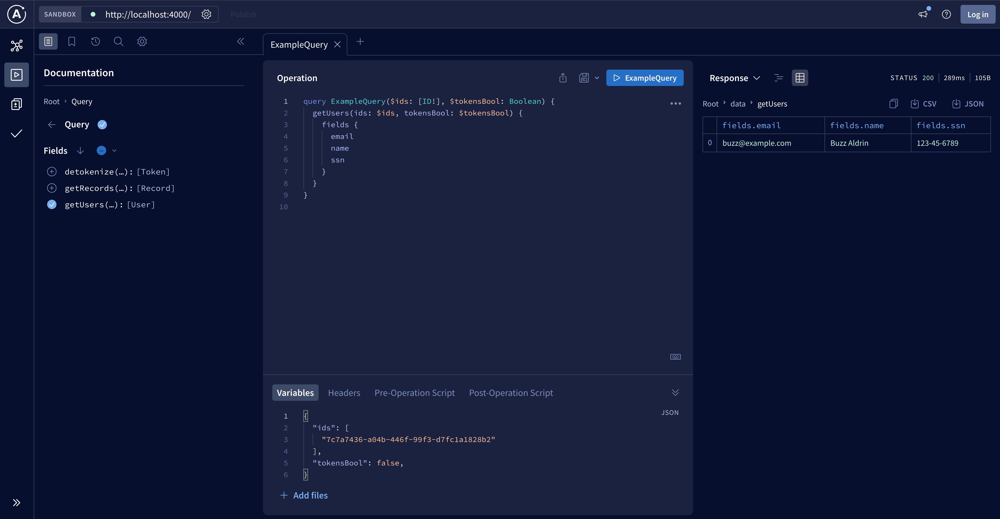

> [!CAUTION]
> Not officially supported by Skyflow. Consider this alpha software which may have issues.

# Example: GraphQL - Apollo Server + Skyflow

## Introduction

Welcome to our guide on integrating GraphQL with Skyflow using Apollo Server and the Skyflow Node.js SDK. This post will walk you through creating a simple GraphQL API and enhancing its capabilities with Skyflow's data privacy vault.



**Understanding GraphQL and Apollo Server**

GraphQL is a powerful query language for APIs, offering more flexibility and efficiency than traditional REST APIs. Apollo Server is a popular open-source GraphQL server that simplifies building GraphQL APIs in Node.js.

**Introduction to Skyflow**

Skyflow offers a data privacy vault for securely handling sensitive data. Using Skyflow's Node.js SDK, we can seamlessly integrate this security into our GraphQL API.

**Setting Up the Environment**

First we'll set up our environment.

Ensure Node.js and npm are installed:

```bash
node -v
```

Create a directory for the project then `cd` into it in Terminal:

```bash
mkdir skyflow_apollo_server && cd skyflow_apollo_server
```

Initialize a new npm project:

```bash
npm init --yes && npm pkg set type="module"
```

Install Apollo Server and the Skyflow Node.js SDK: 

```bash
npm install apollo-server-standalone skyflow-node
```

Create our main JS file:

```bash
touch index.js
```

Replace `scripts` with the following in `package.json`, which was created when we ran `npm init`:

```json
{
  // ...
  "scripts": {
    "start": "node index.js"
  }
  // ...
}
```

Be sure to save that file.

## Building a privacy-first GraphQL server with Apollo and Skyflow

Now for the good stuff. Open index.js in your editor and let's begin.

First, let's import the dependencies and set up a basic "Hello world!" Apollo Server:

```javascript
import { ApolloServer } from '@apollo/server';
import { startStandaloneServer } from '@apollo/server/standalone';
import { Skyflow } from 'skyflow-node';

// 
// A schema is a collection of type definitions (hence "typeDefs")
const typeDefs = gql`
  type Query {
    hello: String
  }
`;

// Resolvers define the technique for fetching the types defined in the schema
const resolvers = {
  Query: {
    hello: () => 'Hello world!',
  },
};

// The ApolloServer constructor requires two parameters: your schema definition and your set of resolvers
const server = new ApolloServer({ typeDefs, resolvers });

server.listen().then(({ url }) => {
  console.log(`🚀 Server ready at ${url}`);
});
```

### Integrating the Skyflow Vault SDK

After the `import`s, configure the Skyflow Vault SDK.

```js
// ## DEV ONLY: set the log level to INFO for more info
setLogLevel(LogLevel.DEBUG);

// ## Set up authentication and the Skyflow Vault client.
const client = Skyflow.init({
  vaultID: process.env.VAULT_ID || '',
  vaultURL: process.env.VAULT_URL || '',
  // getBearerToken expects a function which returns a promise which resolves the bearer token
  getBearerToken: function () {
    return new Promise((resolve, reject) => {
      resolve(process.env.VAULT_ACCESS_TOKEN || '');
    });
  },
});
```
### Create a simple schema for the Vault

Next we will replace our simple "Hello world!" schema with one that can retrieve data from the Vault.

```js
// ## Define the GraphQL schema
const typeDefs = `#graphql
  # Comments in GraphQL strings (such as this one) start with the hash (#) symbol.

  # This "Book" type defines the queryable fields for every book in our data source.
  schema {
    query: Query
    # mutation: Mutation
  }

  type Record {
    id: ID!
    table: String!
    fields: Fields!
  }

  type Token {
    token: String
    value: String!
    tokenGroup: String
  }

  # customized per table
  type Fields {
    name: String
    ssn: String
    email: String
  }

  # users
  type User {
    fields: Fields!
  }

  # ## Query definitions
  # The "Query" type is special: it lists all of the available queries that
  # clients can execute, along with the return type for each. In this
  # case, the "books" query returns an array of zero or more Books (defined above).
  type Query {
    # get record(s) by ID(s)
    getRecords(table: String! ids: [ID!] tokensBool: Boolean): [Record]
    # detokenize tokens
    detokenize(tokens: [String!]): [Token]
    # get users records by ID
    getUsers(ids: [ID!] tokensBool: Boolean) :[User]
  }
`;
```

### Define the Graph's Resolvers

Finally, we need to replace our sample "Hello world!" resolver and add one for each of the queries we defined above.

```js
// ## Define the resolvers to retrieve data
// Resolvers define how to fetch the types defined in your schema.

const resolvers = {
  Query: {
    // ## Resolve `detokenize()` queries
    async detokenize(parent, args, contextValue, info) {
      // construct the request payload
      const recordsForRequest = args.tokens.map((requestedToken) => {
        return { token: requestedToken };
      });
      const requestData = {
        records: recordsForRequest
      };
      try {
        const response = await client.detokenize(requestData);
        return response.records;
      }
      catch (error) {
        console.log(JSON.stringify(error));
        return null;
      }
    },
    // ### Resolve `getRecords()` queries
    async getRecords(parent, args, contextValue, info) {
      // construct the request payload
      const requestData = {
        records: [
          {
            ids: args.ids,
            table: args.table,
            redaction: args.tokensBool ? null : Skyflow.RedactionType.PLAIN_TEXT
          }
        ]
      };
      try {
        const response = await client.get(requestData, { tokens: args.tokensBool });
        return response["records"];
      }
      catch (error) {
        console.log(JSON.stringify(error));
        return null;
      }
    },
    // ### Resolve `getUsers()` queries
    async getUsers(parent, args, contextValue, info) {
      const requestData = {
        records: [
          {
            table: "users",
            ids: args.ids,
            redaction: args.tokensBool ? null : Skyflow.RedactionType.PLAIN_TEXT
          }
        ]
      };
      try {
        const response = await client.get(requestData, { tokens: args.tokensBool });
        return response.records;
      }
      catch (error) {
        console.log(JSON.stringify(error));
        return null;
      }
    },
  },
};
```

### Try it out and explore the graph

```bash
npm start
```

Returns:

```bash
DEBUG: [Skyflow] Initializing skyflow client.
DEBUG: [Skyflow] SkyflowController initialized.
DEBUG: [Skyflow] Get bearer token listener added.
DEBUG: [Skyflow] Initialized skyflow client successfully.
🚀  Server ready at: http://localhost:4000/
```

Now open http://localhost:4000/ in your browser and explore your new Data Privacy Graph powered by Apollo and Skyflow!

